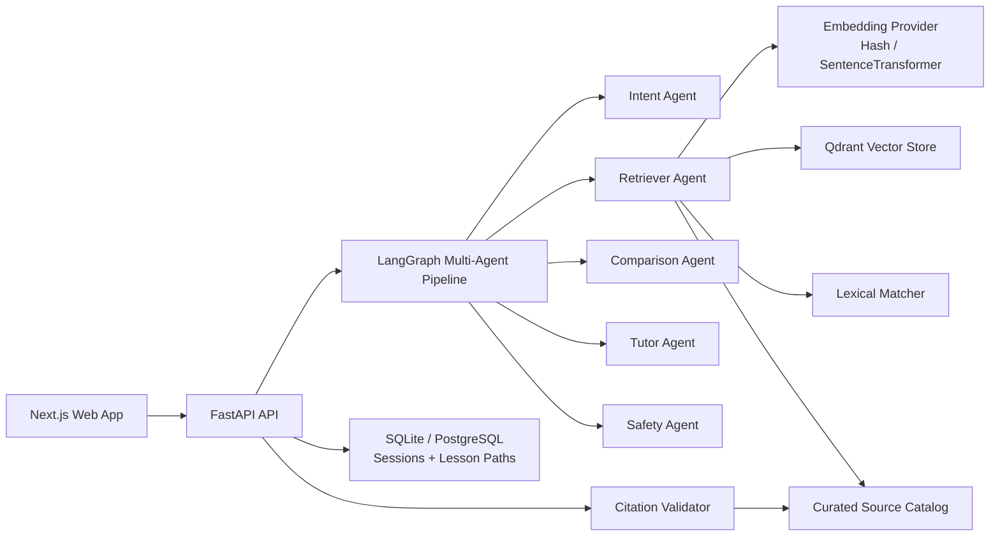
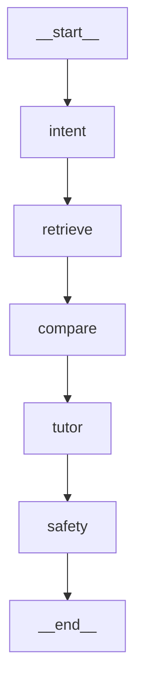

# NurPath Architecture

## System Overview

NurPath is a bilingual (Arabic/English) learning platform with an evidence-first RAG backend and a LangGraph multi-agent tutor pipeline.

### Core layers

1. `frontend/` Next.js UI for tutoring, source exploration, and quiz workflows.
2. `backend/app/api` FastAPI APIs with typed response contracts.
3. `backend/app/agents` LangGraph execution graph for intent, retrieval, comparison, tutoring, and safety.
4. `backend/app/services/retrieval.py` hybrid retrieval (Qdrant vector + lexical fusion).
5. `backend/app/services/embeddings.py` embedding provider abstraction.
6. `backend/app/services/citation.py` citation integrity guard.

## Technical Architecture Diagram

## LangGraph Runtime Topology

Generated from the compiled graph in `backend/app/agents/pipeline.py`.

## Retrieval and RAG Mechanics

1. Normalize question text (Arabic diacritics removed + token cleanup).
2. Generate embedding vector for query.
3. Query Qdrant for vector candidates.
4. Compute lexical overlap scores over catalog passages.
5. Fuse vector and lexical scores into final ranking.
6. Apply source-priority tie-breaking (Quran > Hadith > Fiqh for close scores).
7. Return top evidence cards with strict source references.
8. Run citation validation before response finalization.

## API Contracts

### `POST /v1/ask`

Outputs:

- `direct_answer`
- `evidence_cards[]`
- `opinion_comparison[]`
- `ikhtilaf_analysis` (status + conflict pair metadata)
- `confidence`
- `next_lesson`
- `safety_notice`
- `abstained`

### `GET /v1/architecture/langgraph-mermaid`

Returns generated Mermaid diagram for the active LangGraph pipeline.

### `GET /v1/sources`

Supports `source_type`, `authenticity_level`, and `ui_language` filters for localized source browsing and authenticity-aware catalog views.

## Safety and Trust Guarantees

- Claims must have evidence cards unless abstaining.
- Confidence threshold controls abstention.
- Sensitive/fatwa-personal prompts trigger non-authoritative guidance and escalation.
- Citation span must match retrieved passage IDs.

## Testing Strategy

- Backend unit/integration tests (`pytest`) for sessions, ask flow, retrieval health, source filtering, quiz scoring, and diagram endpoint.
- Ikhtilaf detector unit tests for conflict/consensus/insufficient branches.
- Frontend static checks (`lint`, `typecheck`, `build`).
- Browser E2E tests (Playwright) for:
  - ask flow + evidence rendering
  - source explorer
  - quiz generation and grading
  - safety abstention UX

## Deployment Notes

- Default setup uses local in-memory Qdrant mode for portability.
- Production can switch to external Qdrant via `QDRANT_URL` and disable local mode.
